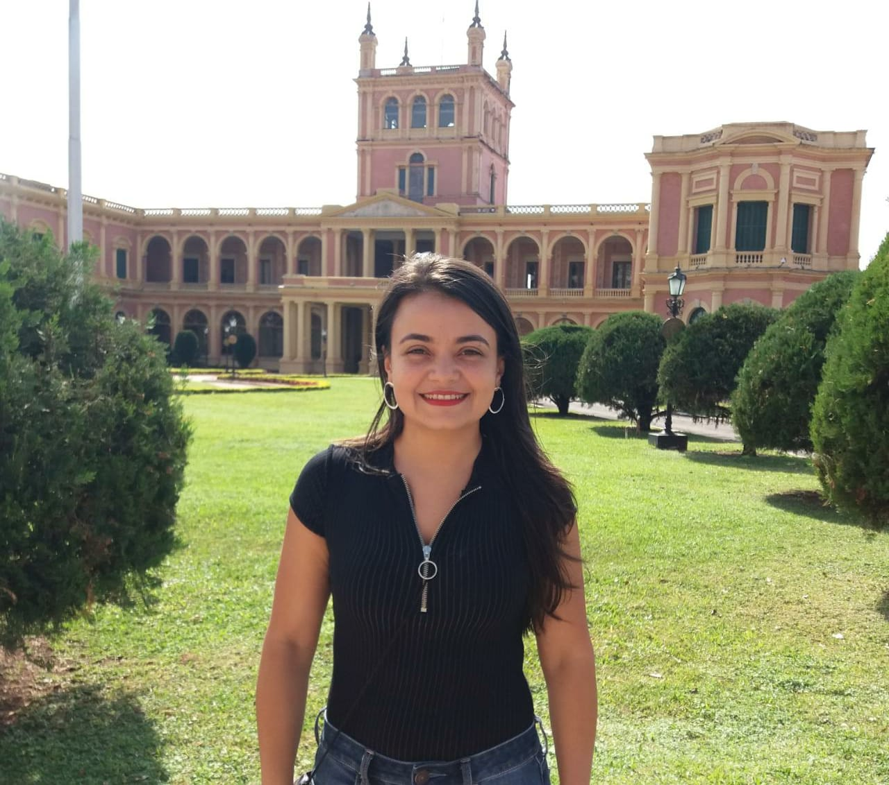

---
---
<link rel="stylesheet" href="styles.css" type="text/css">

 
I am an Assistant Professor of Economics at [Universidad Autónoma Latinoamericana](https://www.unaula.edu.co) (Medellín-Colombia). My research interests lie in the fields of innovations economics, labor, gender and applied microeconometrics 

**2015 PhD in Economics**, Universitat de Barcelona, Spain 
Dissertation: [R&D Cooperation: Determinants, persistence and its effects on firms' innovative performance](https://www.tesisenred.net/handle/10803/287325) 
Advisor: Rosina Moreno (UB) 

Email: erika.badilloen@unaula.edu.co, ebadilloe@gmail.com

My full CV is available [here](files/BadilloER_CV2020.pdf)

 
 
 

**Erika Raquel Badillo Enciso** 
Facultad de Economia 
Universidad Autónoma Latinoamericana (UNAULA) 
Phone: +57 (4) 511 21 99 Ext. 121 
Office: 418, Bloque 1 
Carrera 55 Nº 49 - 51 
Medellín-Colombia
